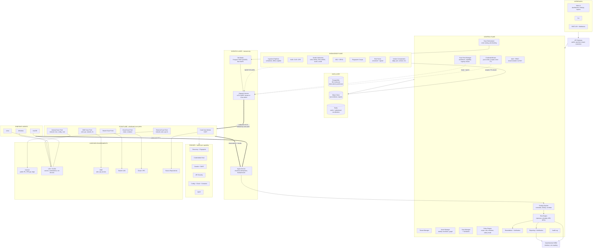

# CyberSentinel Vulnerability Assessment Platform
## Master Architecture Specification — v2

**Status:** Authoritative. Supersedes v1 (§1–§60).
**Companion files:** `architecture.mermaid`, `erd.mermaid`, `scan-flow.mermaid` — same diagrams as embedded below, shipped separately for rendering.

---

## 1. What changed from v1 and why

v1's architecture was structurally correct. v2 keeps every load-bearing decision and closes the gaps that would otherwise be baked into the Phase 1 schema and wire contracts.

| # | Change | Reason |
|---|---|---|
| 1 | Knowledge Plane promoted from a bullet list to a first-class plane with its own ingestion pipelines | Detection content, not engines, is where the product succeeds or fails |
| 2 | Vendor advisory feeds added as the matching authority for distro packages | NVD-only version matching reports every backported package as vulnerable |
| 3 | `Observation` entity introduced between scan results and assets | Enables reversible merges, re-runnable correlation, correct exposure, and an audit trail |
| 4 | `Vulnerability` split into `Rule`, `VulnerabilityDef`, and `VendorAdvisory` | DAST/SAST/config findings have a rule and CWE but no CVE |
| 5 | `zone` removed from the asset table; exposure derived from observations | Assets move; a stored zone produces wrong exposure reporting |
| 6 | Asset identity resolution specified as a ranked-key algorithm with merge evidence | v1 stated the principle with no mechanism |
| 7 | `Scan → Job → Task` three-level decomposition | A /16 as one job has no partial progress and catastrophic retry |
| 8 | Job leases with monotonic fencing epochs replace heartbeat-then-retry | Prevents two scan points concurrently hammering one production target |
| 9 | Message broker moved behind an internal dispatch service | v1 §52 implied exposing a broker to the internet, contradicting §35 |
| 10 | Detection execution split defined: request-coupled at scan point, evidence-based at Core | v1 left this ambiguous; it determines the rule update story |
| 11 | Protocol versioning and capability negotiation added | Scan points in customer networks run months-old builds |
| 12 | Result submission contract specified: idempotent, chunked, backpressured, locally durable | Not addressed in v1; fails early at real volume |
| 13 | Credentials delivered just-in-time and scoped, memory-only on scan points | v1 covered storage but not delivery |
| 14 | Roadmap re-sequenced: knowledge and credentialed assessment up, SAST down | Precision before breadth |

---

## 2. Scope boundary: what we build, what we consume

v1 §55 said to build capabilities rather than wrap existing scanners. That is correct and remains the rule. It needs a boundary, or the team will spend a quarter writing a lexer.

**Build ourselves.** Discovery logic and scheduling. Fingerprinting heuristics and the signature corpus. Asset identity resolution. The rule engine and rule language. Crawler logic and application modelling. Taint analysis. The risk model. The finding pipeline. Every part of the control plane, data model and orchestration.

**Consume, do not rebuild.** TLS stacks. HTTP clients. Packet capture primitives. Parser generators and language grammars. CVE, CPE and advisory data. CVSS calculators. Compression and cryptography.

The line is *security analysis* versus *commodity infrastructure*. Using tree-sitter grammars as SAST frontends is not wrapping a SAST tool — the analysis on top of the AST is the product. Reimplementing a TLS parser is not an achievement; it is a liability you will be asked to justify in every procurement review.

---

## 3. Architectural principles (v2)

1. **Distributed scanning.** No single scanner reaches everything. Scan Points sit where the traffic must originate.
2. **Vantage point is data.** Every observation records who saw it, from where, when, under which policy, with which credentials.
3. **Centralized control, distributed execution.** Control Plane decides; Scan Points execute; Agents supply local visibility.
4. **Observation-first.** Scan Points emit immutable observations. Assets and findings are *derived*, never written directly.
5. **Asset-centric.** IP addresses are time-bounded attributes, not identities.
6. **Unified findings.** One finding model across network, host, DAST, API, SAST, config, cloud and container.
7. **Policy-driven.** Scope, rate, windows, engines, credentials and scan point eligibility are all policy, never code.
8. **Knowledge is a product surface.** Detection content is maintained continuously, versioned, and signed.
9. **Precision before breadth.** A confident finding beats three uncertain ones. Confidence is a first-class field.
10. **Detection, not exploitation.** Establish evidence of a vulnerability without achieving impact.
11. **Failure tolerant, but at-most-once where it matters.** Passive work retries freely. Intrusive work fails loudly rather than duplicating.
12. **Secure by design.** Core holds a complete map of the customer's weaknesses plus credentials to their estate. Threat model it accordingly.
13. **Extensible engines.** New engines register capabilities; the Control Plane does not change.
14. **Deployment flexibility.** Compose, VM, Kubernetes, appliance. SaaS and on-prem from one codebase.

---

## 4. Plane model

v1 had two planes. v2 has four. The Knowledge Plane and Data Layer were implicit in v1 and both need explicit ownership.

- **Control Plane** — decides. Auth, tenancy, policy, orchestration, asset management, finding pipeline, risk, reporting, audit. Performs no scanning.
- **Knowledge Plane** — knows. Ingests and normalises CVE, CPE, vendor advisories, KEV, EPSS. Owns rule packs, fingerprint corpus, and version comparators. Runs on a schedule, fully offline-capable for air-gapped deployments.
- **Scan Plane** — executes. Distributed Scan Points loading engines according to declared capabilities.
- **Data Layer** — remembers. Postgres as system of record with row-level security, object store for raw evidence and reports, Redis for cache and ephemeral coordination.

---

## 5. Architecture diagram



**The dispatch correction.** v1 showed the message queue fanning out directly to external, internal and DMZ scan points. Combined with §35's outbound-only rule, that implies a broker exposed to the internet. In v2 the broker is internal to Core. Scan points hold a long-lived authenticated gRPC stream to the Dispatch Service, which pulls from the broker. Scan points never learn the broker's protocol or address.

---

## 6. Technology decisions

**Go for Core, Scan Points and Agents.** Chosen for product-specific reasons, not preference. Scan points and agents deploy into environments you do not control, so a single static binary with no runtime dependency is worth a great deal in support cost — this alone eliminates Python for those components. Scanning is overwhelmingly concurrent IO with tens of thousands of in-flight connections, which the goroutine model fits directly. Cross-compilation to Windows, Linux and macOS for Phase 9 agents is trivial. `gopacket` is mature for raw socket work. The infrastructure security ecosystem is largely Go, which helps hiring and library availability.

**Python for Knowledge Plane pipelines.** Data wrangling against messy feeds where iteration speed dominates and deployment is server-side only.

**Rust held in reserve.** Better for the packet hot loop and SAST data structures, with a real velocity cost. Because engines are separate processes behind a job contract, a single engine can be rewritten in Rust later without touching anything else. Do not pay that cost up front.

**PostgreSQL as system of record.** It will carry you far past the point you expect. Row-level security enforces tenant isolation so a forgotten `WHERE` clause is a denial rather than a cross-tenant disclosure.

**Job dispatch: Postgres `SELECT ... FOR UPDATE SKIP LOCKED` first.** It handles far more throughput than a scanning workload generates, gives transactional job state for free, and removes a component from the on-prem install. Introduce NATS JetStream when there is a measured reason.

**Object store for evidence.** HTTP transactions, packet captures, screenshots and generated reports do not belong in Postgres. S3-compatible, so MinIO covers on-prem.

---

## 7. Deployment and tenancy

Both SaaS and on-prem are targets, so the platform is **tenant-aware always, single-tenant by configuration**. On-prem is a deployment with one tenant row, not a separate code path. That is the only version of "both" that does not become two products.

Every table carries `tenant_id` and RLS is on by default. Application roles never bypass it; only migrations do.

**PKI is the part that genuinely differs.** In SaaS, Core is a CA issuing identities to customer-deployed scan points reaching across the internet. On-prem, the customer's Core is the CA for a local fleet. Design enrollment so the trust anchor is configuration rather than an assumption, and so the token-based enrollment flow is byte-identical in both.

**On-prem carries costs v1 did not budget.** You ship into environments you cannot observe. Required from Phase 1: a diagnostics bundle command, structured local logs with redaction, a published supported-version policy, and an offline update path for rule packs and knowledge data. Air-gapped customers exist in this market and will ask on the first call.

Deployment sizes: single-node Compose for labs and small orgs; VM or Compose multi-node for mid-market; Kubernetes for large SaaS. Kubernetes is never mandatory.

---

## 8. Domain model

### 8.1 Observation-first

Scan Points do not write assets or findings. They emit **observations**: immutable, timestamped records of what was seen, by which scan point, from which vantage zone, with what confidence.

Assets, services, software components and findings are all derived from observations by Core. This buys four things at once: asset merges become reversible because the evidence is retained; multi-vantage-point exposure falls out naturally; correlation can be re-run after fixing a bug without re-scanning; and every finding can answer "why does the system believe this," which is the question every analyst asks about every finding they doubt.

### 8.2 Asset identity resolution

Merging requires either one strong key, or corroborating agreement among weaker ones. Every merge records the observation that justified it.

| Strength | Keys |
|---|---|
| **Strong (3)** | Agent-issued UUID; cloud instance ID; DMI system UUID; TPM or host certificate fingerprint |
| **Moderate (2)** | SSH host key fingerprint; stable service certificate fingerprint; hostname + domain + consistent OS fingerprint |
| **Weak (1)** | MAC address; NetBIOS name; IP within a time window |

IP alone never merges. MAC is weak deliberately — it is virtualised, randomised by default on modern client OSes, and duplicated across VM template clones. Conflicting or insufficient evidence sends the observation to an unresolved queue for operator review rather than guessing.

`ASSET_ADDRESS` carries `valid_from` / `valid_to`. An IP is a time-bounded relationship, not a column on the asset.

### 8.3 Zone and exposure are derived

v1 put `zone` on the asset. A laptop is on Corporate LAN, then home wifi, then a hotel; a cloud instance changes subnets. What has a zone is the *observation*.

Exposure is therefore computed: which vantage points can currently see this asset, and what does each one see. That is exactly the multi-vantage-point data v1 §12 already committed to collecting, so this turns a stale column into the product's differentiator.

### 8.4 Rule, VulnerabilityDef, Advisory, Finding

Four entities where v1 had two.

- **Rule** — detection logic, versioned, belongs to a signed rule pack. Always present on a finding. Carries `execution_site` (scan point or core).
- **VulnerabilityDef** — a CVE record with CVSS, KEV flag, EPSS score, CPE ranges. Optional on a finding. Many-to-many with rules in both directions.
- **VendorAdvisory** — USN, RHSA, DSA, MSRC and friends, with child `ADVISORY_FIXED_PACKAGE` rows giving the fixed version per distro release. This is the matching authority for anything installed by a package manager.
- **Finding** — the observed instance: asset, rule, instance locator, evidence, exposure set.

### 8.5 Finding identity

The dedup key determines whether dashboard counts mean anything and whether findings churn for no reason.

| Source | Dedup key |
|---|---|
| Network / service | asset, port, protocol, rule |
| Credentialed host | asset, package or component identity, rule |
| DAST | target, normalised URL path, parameter name, rule |
| API | endpoint, method, parameter, rule |
| SAST | repository, file path, **enclosing symbol**, rule |
| Configuration | asset, setting path, rule |
| Cloud | resource ARN or equivalent, rule |

Two traps. SAST must key on the enclosing function or symbol, never the line number — line numbers shift on every unrelated edit above them, and a whitespace change would otherwise close and reopen every finding in the file. DAST must normalise URLs before keying, or one vulnerable template behind `/users/{id}/profile` produces thousands of findings.

The same CVE on the same host seen from internal and DMZ is **one finding with two exposures**, not two findings. Getting this wrong inflates the critical count by the number of vantage points, which is the first number an executive looks at.

---

## 9. Entity relationship diagram

> The schema carries four tables this diagram does not draw: `result_submissions`
> (ADR-026's idempotency ledger), `asset_resolution_queue` (ADR-007's unresolved merge
> queue), and `scan_policy_credential_profiles` and `advisory_vuln_map` (join tables for
> the `SCAN_POLICY }o--o{ CREDENTIAL_PROFILE` and `VULNERABILITY_DEF }o--o{ VENDOR_ADVISORY`
> lines below, which mermaid draws as lines and a relational schema cannot).
> **See ADR-029**, which is authoritative. Generating migrations from this diagram alone produces a schema that
> cannot satisfy ADR-007 or ADR-026.

```mermaid
erDiagram

    TENANT ||--o{ USER : "employs"
    TENANT ||--o{ ROLE : "defines"
    ROLE ||--o{ USER : "assigned to"
    TENANT ||--o{ SCAN_ZONE : "owns"
    TENANT ||--o{ ASSET : "owns"
    TENANT ||--o{ SCAN_POLICY : "defines"
    TENANT ||--o{ SCAN : "requests"
    TENANT ||--o{ CREDENTIAL_PROFILE : "holds"
    TENANT ||--o{ REPORT : "receives"
    TENANT ||--o{ AUDIT_EVENT : "records"

    SCAN_ZONE ||--o{ SCAN_POINT : "hosts"
    SCAN_ZONE ||--o{ NETWORK_RANGE : "contains"
    SCAN_POINT ||--o{ SCAN_POINT_CAPABILITY : "declares"
    SCAN_POINT ||--o{ SCAN_JOB : "executes"
    SCAN_POINT ||--o{ OBSERVATION : "reports"

    SCAN_POLICY ||--o{ SCAN : "governs"
    SCAN_POLICY }o--o{ CREDENTIAL_PROFILE : "authorizes"
    SCAN_POLICY ||--o{ POLICY_SCOPE_RULE : "constrains"

    SCAN ||--o{ SCAN_TARGET : "declares"
    SCAN ||--o{ SCAN_JOB : "decomposes into"
    SCAN_JOB ||--o{ SCAN_TASK : "decomposes into"
    SCAN_JOB ||--o| JOB_LEASE : "held under"
    SCAN_JOB ||--o{ CREDENTIAL_GRANT : "issued"
    SCAN_TARGET ||--o{ SCAN_TASK : "expands to"
    SCAN_TASK ||--o{ OBSERVATION : "produces"

    CREDENTIAL_PROFILE ||--o{ CREDENTIAL_GRANT : "released as"

    OBSERVATION }o--|| SCAN_ZONE : "seen from"
    OBSERVATION }o--o| ASSET : "resolved to"
    OBSERVATION ||--o{ EVIDENCE : "supports"

    ASSET ||--o{ ASSET_IDENTITY_KEY : "identified by"
    ASSET ||--o{ ASSET_ADDRESS : "reachable at"
    ASSET ||--o{ SERVICE : "exposes"
    ASSET ||--o{ SOFTWARE_COMPONENT : "runs"
    ASSET ||--o{ ASSET_RELATIONSHIP : "source of"
    ASSET ||--o{ FINDING : "affected by"

    RULE_PACK ||--o{ RULE : "contains"
    RULE ||--o{ RULE_VULN_MAP : "detects"
    RULE ||--o{ FINDING : "raised by"
    VULNERABILITY_DEF ||--o{ RULE_VULN_MAP : "detected by"
    VULNERABILITY_DEF |o--o{ FINDING : "optionally cites"
    VULNERABILITY_DEF }o--o{ VENDOR_ADVISORY : "addressed by"
    VENDOR_ADVISORY ||--o{ ADVISORY_FIXED_PACKAGE : "fixes in"

    FINDING ||--o{ FINDING_EXPOSURE : "visible via"
    FINDING ||--o{ EVIDENCE : "proven by"
    FINDING ||--o{ FINDING_HISTORY : "transitions through"
    FINDING ||--o| REMEDIATION : "closed by"
    FINDING_EXPOSURE }o--|| SCAN_ZONE : "from zone"

    TENANT {
        uuid tenant_id PK
        text name
        text deployment_mode "saas or onprem"
        text status
        timestamp created_at
    }

    USER {
        uuid user_id PK
        uuid tenant_id FK
        uuid role_id FK
        text email UK
        text auth_provider
        text status
    }

    ROLE {
        uuid role_id PK
        uuid tenant_id FK
        text name
        jsonb permissions
    }

    SCAN_ZONE {
        uuid zone_id PK
        uuid tenant_id FK
        text name
        text zone_type "external dmz internal branch cloud mgmt"
        int trust_level
        text description
    }

    NETWORK_RANGE {
        uuid range_id PK
        uuid zone_id FK
        cidr cidr
        bool is_authorized
    }

    SCAN_POINT {
        uuid scan_point_id PK
        uuid zone_id FK
        text hostname
        text agent_version
        text protocol_version
        text status
        timestamp last_heartbeat
        text cert_fingerprint UK
    }

    SCAN_POINT_CAPABILITY {
        uuid capability_id PK
        uuid scan_point_id FK
        text engine "discovery host dast api sast cloud"
        text engine_version
        bool enabled
    }

    SCAN_POLICY {
        uuid policy_id PK
        uuid tenant_id FK
        text name
        text safety_mode "safe or intrusive"
        int max_rate_pps
        jsonb time_windows
        jsonb allowed_engines
        jsonb allowed_zones
    }

    POLICY_SCOPE_RULE {
        uuid scope_rule_id PK
        uuid policy_id FK
        text effect "allow or deny"
        text match_type "cidr hostname url tag"
        text match_value
        int precedence
    }

    SCAN {
        uuid scan_id PK
        uuid tenant_id FK
        uuid policy_id FK
        uuid requested_by FK
        text scan_type
        text status
        timestamp created_at
        timestamp completed_at
    }

    SCAN_TARGET {
        uuid target_id PK
        uuid scan_id FK
        text target_type "cidr host url repo cloud_account"
        text target_value
        bool authorization_verified
    }

    SCAN_JOB {
        uuid job_id PK
        uuid scan_id FK
        uuid scan_point_id FK
        text engine
        text status
        int attempt
        bool reassign_safe
        timestamp created_at
    }

    JOB_LEASE {
        uuid lease_id PK
        uuid job_id FK
        bigint epoch "monotonic fencing token"
        uuid holder_scan_point FK
        timestamp expires_at
        timestamp renewed_at
    }

    SCAN_TASK {
        uuid task_id PK
        uuid job_id FK
        uuid target_id FK
        text task_target
        text status
        int progress_pct
    }

    CREDENTIAL_PROFILE {
        uuid credential_profile_id PK
        uuid tenant_id FK
        text name
        text cred_type "ssh winrm snmp cloud api"
        text secret_ref "vault pointer, never plaintext"
        jsonb scope_constraints
    }

    CREDENTIAL_GRANT {
        uuid grant_id PK
        uuid credential_profile_id FK
        uuid job_id FK
        timestamp issued_at
        timestamp expires_at
        text delivered_to_fingerprint
    }

    OBSERVATION {
        uuid observation_id PK
        uuid tenant_id FK
        uuid task_id FK
        uuid scan_point_id FK
        uuid zone_id FK "vantage point"
        uuid asset_id FK "nullable until resolved"
        text observation_type "host port service banner package config verdict"
        jsonb payload
        numeric confidence
        timestamp observed_at
    }

    ASSET {
        uuid asset_id PK
        uuid tenant_id FK
        text primary_hostname
        text os_family
        text os_version
        text device_type
        text vendor
        text criticality
        text environment
        text owner
        timestamp first_seen
        timestamp last_seen
    }

    ASSET_IDENTITY_KEY {
        uuid identity_key_id PK
        uuid asset_id FK
        text key_type "agent_uuid dmi_uuid cloud_id ssh_hostkey cert_fp mac hostname"
        text key_value
        int strength "1 weak to 3 strong"
        uuid merge_evidence_observation FK
        timestamp valid_from
        timestamp valid_to
    }

    ASSET_ADDRESS {
        uuid address_id PK
        uuid asset_id FK
        inet ip_address
        text mac_address
        timestamp valid_from
        timestamp valid_to "time bounded, never a plain column"
    }

    SERVICE {
        uuid service_id PK
        uuid asset_id FK
        int port
        text protocol
        text service_name
        text product
        text version
        numeric version_confidence
        timestamp last_seen
    }

    SOFTWARE_COMPONENT {
        uuid component_id PK
        uuid asset_id FK
        text source "package_manager registry binary sbom"
        text distro "ubuntu2004 rhel9 windows"
        text package_name
        text installed_version
        text cpe_guess
        timestamp last_seen
    }

    ASSET_RELATIONSHIP {
        uuid relationship_id PK
        uuid source_asset_id FK
        uuid target_asset_id FK
        text relationship_type "routes_to fronts depends_on hosts"
        numeric confidence
    }

    RULE_PACK {
        uuid rule_pack_id PK
        text name
        text version
        text signature
        timestamp published_at
    }

    RULE {
        uuid rule_id PK
        uuid rule_pack_id FK
        text name
        text category
        text engine
        text execution_site "scan_point or core"
        text default_severity
        numeric base_confidence
        text cwe
        jsonb detection_logic
        jsonb evidence_requirements
        text remediation_template
        int version
    }

    VULNERABILITY_DEF {
        uuid vuln_def_id PK
        text cve_id UK
        text title
        text description
        numeric cvss_base
        text cvss_vector
        bool in_kev "CISA known exploited"
        numeric epss_score
        jsonb cpe_ranges
        timestamp published_at
    }

    RULE_VULN_MAP {
        uuid map_id PK
        uuid rule_id FK
        uuid vuln_def_id FK
        numeric match_confidence
    }

    VENDOR_ADVISORY {
        uuid advisory_id PK
        text advisory_ref UK "USN-1234-1 RHSA-2024-0001"
        text vendor
        text distro_release
        text severity
        timestamp issued_at
    }

    ADVISORY_FIXED_PACKAGE {
        uuid fixed_pkg_id PK
        uuid advisory_id FK
        text distro_release
        text package_name
        text fixed_version "authority for backport-aware matching"
        text comparator "dpkg or rpm"
    }

    FINDING {
        uuid finding_id PK
        uuid tenant_id FK
        uuid asset_id FK
        uuid rule_id FK
        uuid vuln_def_id FK "nullable"
        text dedup_key UK "per source instance key"
        text instance_locator "port param file symbol resource"
        text severity
        numeric confidence
        text status
        timestamp first_seen
        timestamp last_seen
        timestamp resolved_at
    }

    FINDING_EXPOSURE {
        uuid exposure_id PK
        uuid finding_id FK
        uuid zone_id FK
        bool internet_reachable
        bool auth_required
        timestamp last_confirmed
    }

    EVIDENCE {
        uuid evidence_id PK
        uuid finding_id FK
        uuid observation_id FK
        text evidence_type "banner response package_version config_value code_span"
        jsonb data
        text object_store_ref
        timestamp captured_at
    }

    FINDING_HISTORY {
        uuid history_id PK
        uuid finding_id FK
        text from_status
        text to_status
        uuid changed_by FK
        text reason
        timestamp changed_at
    }

    REMEDIATION {
        uuid remediation_id PK
        uuid finding_id FK
        text description
        text assigned_to
        text status
        timestamp due_at
        timestamp verified_at
        uuid verifying_scan_id FK
    }

    REPORT {
        uuid report_id PK
        uuid tenant_id FK
        text report_type
        jsonb parameters
        text object_store_ref
        timestamp generated_at
    }

    AUDIT_EVENT {
        uuid audit_event_id PK
        uuid tenant_id FK
        uuid actor_id
        text actor_type "user scan_point system"
        text action
        text resource_type
        uuid resource_id
        jsonb detail
        timestamp occurred_at
    }
```



### 9.1 Storage notes

> Where this section and `docs/adr/` disagree, **the ADRs are authoritative**. This document
> records what was decided in August; ADRs are how those decisions change.

- **RLS on every tenant-scoped table.** Policy is `tenant_id = current_setting('app.tenant_id')::uuid`. Application roles cannot bypass.
- **Partition `OBSERVATION` and `EVIDENCE` by month.** They are the growth vector. Raw observations retain 90 days by default; derived findings retain indefinitely. *Superseded by ADR-016: `OBSERVATION` is partitioned, `EVIDENCE` is not.*
- **`FINDING_HISTORY` is a state-change log**, not a row per finding per scan. A weekly scan of 10,000 findings must not write 10,000 rows a week.
- **Large evidence goes to object store**, with `EVIDENCE.data` holding a summary and `object_store_ref` the pointer.
- **`ASSET_ADDRESS` and `ASSET_IDENTITY_KEY` use validity intervals.** Query current state with `valid_to IS NULL`.

---

## 10. Scan execution model

### 10.1 Three levels

- **Scan** — user intent. "Assess corporate infrastructure." Holds policy, targets, aggregate status.
- **Job** — one unit assigned to one Scan Point, one engine, bounded to roughly minutes of work. The unit of leasing, retry and progress.
- **Task** — individual target work inside a job. The unit of observation attribution.

Ranges are chunked into jobs at dispatch time. A /16 becomes many jobs, which can spread across multiple scan points in the same zone, report partial progress, and retry cheaply.

### 10.2 Job lifecycle with lease fencing

v1's heartbeat-timeout-then-retry is at-least-once. For active scanning that is harmful: a partition that makes Worker A *look* dead while it is still running means A and B both hit the same production application, doubling load and defeating the policy's rate limit.

The lease protocol:

1. Dispatch assigns a job with a lease carrying an expiry and a **monotonically increasing epoch**.
2. The Scan Point renews periodically and **must self-abort and zeroise credentials** if renewal fails, rather than continuing optimistically.
3. Result submission includes the epoch. Core rejects results from a superseded epoch.
4. Reassignment happens only after demonstrable lease expiry, with a new epoch.

Jobs carry `reassign_safe`. Passive discovery is safe to duplicate and retries freely. Active DAST, intrusive checks and anything credentialed that changes state is not: on lease loss those fail loudly and surface to an operator instead of silently retrying.

---

## 11. Scan flow

```mermaid
flowchart TD

    START(["User or schedule requests scan"])

    subgraph AUTHZ["1. AUTHORIZATION AND SCOPE"]
        A1["Load scan policy"]
        A2["Expand targets<br/>CIDR, hostname, URL, repo"]
        A3{"Every target inside<br/>tenant allowlist?"}
        A4{"Any target matches<br/>exclusion rule?"}
        A5{"Inside approved<br/>time window?"}
        AREJ["REJECT<br/>audit event, notify requester"]
    end

    subgraph PLAN["2. PLANNING"]
        P1["Resolve target to Scan Zone<br/>via network range map"]
        P2["Select eligible Scan Points<br/>zone permission + capability + version"]
        P3{"Capable scan point<br/>online in zone?"}
        PQ["Queue as blocked<br/>alert operator"]
        P4["Chunk targets into Jobs<br/>bounded to minutes of work"]
        P5["Mark each job reassign_safe<br/>passive yes, intrusive no"]
        P6["Expand jobs into Tasks"]
    end

    subgraph DISPATCH["3. DISPATCH"]
        D1["Enqueue jobs on internal broker"]
        D2["Scan point opens outbound mTLS stream"]
        D3["Capability and protocol version handshake"]
        D4["Dispatch service leases job<br/>issues epoch + expiry"]
        D5{"Job needs<br/>credentials?"}
        D6["Credential broker releases<br/>scoped, short TTL, memory only"]
    end

    subgraph EXEC["4. EXECUTION AT SCAN POINT"]
        E1["Host discovery"]
        E2["Port and service discovery<br/>adaptive rate limit, fragile-device guard"]
        E3["Protocol and version fingerprinting"]
        E4["Credentialed collection<br/>package inventory, config state"]
        E5["Request-coupled detection<br/>DAST active, timing, handshake probes"]
        E6["Emit Observations<br/>immutable, timestamped, vantage-tagged"]
        LEASE{"Lease renewable?"}
        ABORT["Self-abort, zeroise credentials<br/>discard partial active work"]
    end

    subgraph SUBMIT["5. RESULT SUBMISSION"]
        S1["Buffer locally if Core unreachable"]
        S2["Chunked upload with submission ID"]
        S3{"Epoch still current?"}
        SREJ["Reject stale results<br/>job already reassigned"]
        S4["Idempotent ingest, dedup by submission ID"]
        S5["Backpressure signal if Core saturated"]
    end

    subgraph RESOLVE["6. ASSET RESOLUTION"]
        R1["Store observations"]
        R2["Extract identity keys<br/>agent uuid, dmi, cloud id, hostkey, cert, mac"]
        R3{"Strong key match<br/>to existing asset?"}
        R4{"Corroborating weak<br/>keys agree?"}
        R5["Merge into existing asset<br/>record merge evidence"]
        R6["Create new asset"]
        R7["Hold as unresolved<br/>queue for review"]
        R8["Update time-bounded addresses<br/>services, software components"]
    end

    subgraph DETECT["7. CORE-SIDE DETECTION"]
        C1["Evidence-based rule evaluation"]
        C2{"Component from a<br/>distro package manager?"}
        C3["Match vendor advisory<br/>by distro release + package"]
        C4["Compare with dpkg or rpm comparator<br/>backport aware"]
        C5["Fallback CPE match against NVD<br/>lower confidence, flagged"]
        C6["Candidate findings with confidence"]
    end

    subgraph PIPE["8. FINDING PIPELINE"]
        F1["Normalize to unified finding model"]
        F2["Compute dedup key<br/>source-specific instance key"]
        F3{"Existing open finding<br/>with same key?"}
        F4["Update last_seen<br/>append evidence"]
        F5["Create finding<br/>status NEW"]
        F6{"Previously resolved?"}
        F7["Reopen, log transition"]
        F8["Aggregate exposure per vantage point<br/>one finding, many exposures"]
        F9["Correlate to asset relationship graph"]
    end

    subgraph RISKP["9. RISK AND OUTPUT"]
        K1["Risk engine<br/>CVSS x exposure x criticality"]
        K2["Apply KEV override and EPSS ordering"]
        K3["Attack path weighting from asset graph"]
        K4["Priority score"]
        K5["Dashboard"]
        K6["Reports"]
        K7["Notifications and webhooks"]
        K8["SIEM interface"]
    end

    subgraph VERIFY["10. VERIFICATION LOOP"]
        V1["Remediation assigned"]
        V2["Targeted re-scan of finding instance"]
        V3{"Still detected?"}
        V4["Close, record verified_at"]
        V5["Keep open, increment attempts"]
    end

    START --> A1 --> A2 --> A3
    A3 -- no --> AREJ
    A3 -- yes --> A4
    A4 -- yes --> AREJ
    A4 -- no --> A5
    A5 -- no --> PQ
    A5 -- yes --> P1

    P1 --> P2 --> P3
    P3 -- no --> PQ
    P3 -- yes --> P4 --> P5 --> P6 --> D1

    D1 --> D2 --> D3 --> D4 --> D5
    D5 -- yes --> D6 --> E1
    D5 -- no --> E1

    E1 --> E2 --> E3 --> E4 --> E5 --> E6
    E6 --> LEASE
    LEASE -- no --> ABORT
    LEASE -- yes --> S1
    ABORT --> D1

    S1 --> S2 --> S3
    S3 -- no --> SREJ
    S3 -- yes --> S4 --> S5 --> R1

    R1 --> R2 --> R3
    R3 -- yes --> R5
    R3 -- no --> R4
    R4 -- yes --> R5
    R4 -- no --> R6
    R4 -- ambiguous --> R7
    R5 --> R8
    R6 --> R8
    R8 --> C1

    C1 --> C2
    C2 -- yes --> C3 --> C4 --> C6
    C2 -- no --> C5 --> C6
    C6 --> F1

    F1 --> F2 --> F3
    F3 -- yes --> F4 --> F8
    F3 -- no --> F6
    F6 -- yes --> F7 --> F8
    F6 -- no --> F5 --> F8
    F8 --> F9 --> K1

    K1 --> K2 --> K3 --> K4
    K4 --> K5
    K4 --> K6
    K4 --> K7
    K4 --> K8
    K4 --> V1

    V1 --> V2 --> V3
    V3 -- no --> V4
    V3 -- yes --> V5 --> V2
```



---

## 12. Detection execution split

v1 left this ambiguous. The rule is: **split on whether the test and the verdict are separable.**

**At the Scan Point** — detection is request-coupled, meaning the verdict depends on an interaction that cannot be reconstructed from stored evidence. DAST active checks, timing-based inference, protocol handshake behaviour, TLS negotiation quirks.

**At Core** — detection is evidence-based. The Scan Point reports what it observed; Core decides what it means. Software versions, package inventories, configuration values, banners, certificate contents, cloud resource state.

Nearly all rules live in the second category. Centralising them means a rule update is a Core deploy rather than a fleet-wide distribution problem across networks you do not control, and a rule correction retroactively fixes historical findings. The cost is result payload size, which is worth paying.

`RULE.execution_site` records which side a rule runs on, and the Scan Point only receives rule packs containing scan-point rules.

---

## 13. Knowledge subsystem

This is the part of the product that never stops needing work, and it needs a named owner.

### 13.1 The backport problem

Scan an Ubuntu 20.04 host and find `openssl 1.1.1f-1ubuntu2.16`. NVD says CVE-2022-0778 affects OpenSSL 1.1.1 through 1.1.1n. Naive comparison reports the host vulnerable. It is not — Ubuntu backported the fix into the package revision while leaving the upstream version at 1.1.1f. Every enterprise distribution does this for every package.

Match on upstream versions alone and credentialed Linux scanning produces false positives at a rate that makes the feature unusable. The customer's Linux team stops trusting the tool permanently after the first report.

### 13.2 Ingestion sources

| Source | Purpose |
|---|---|
| NVD CVE + CPE dictionary | Descriptive metadata, CVSS, fallback matching for non-package software |
| Ubuntu USN + OVAL | Authority for Ubuntu package versions |
| Red Hat RHSA + security data API + OVAL | Authority for RHEL, Rocky, Alma |
| Debian DSA + security tracker JSON | Authority for Debian |
| SUSE SU + OVAL | Authority for SLES, openSUSE |
| Alpine secdb | Authority for Alpine, container base images |
| Amazon ALAS | Authority for Amazon Linux |
| Microsoft MSRC CVRF | Authority for Windows and Microsoft products |
| CISA KEV | Confirmed in-the-wild exploitation. Small, high signal, dominates CVSS in prioritisation |
| FIRST EPSS | Daily probability of exploitation. Better than CVSS for backlog ordering. Free CSV |

KEV and EPSS are roughly two days of work each and improve prioritisation quality more than anything else on the advanced-risk list.

### 13.3 Version comparison

`dpkg --compare-versions` semantics with epochs and tildes, and RPM's `rpmvercmp`, are both non-lexicographic and mutually incompatible. Implement each precisely and unit test against the distributions' own public test corpora. Getting this subtly wrong produces silent false negatives, which are worse than false positives because nobody reports them.

### 13.4 CPE is a fallback, not a mechanism

For non-package software, CPE matching is unavoidable and unreliable — the dictionary is incomplete, vendor and product strings are inconsistent across entries for the same software, and NVD's version range expressions are frequently overly broad. Maintain a curated mapping layer between fingerprints and CPE names, with confidence attached, and flag CPE-derived findings as lower confidence in the UI.

### 13.5 Fingerprint corpus

Service and OS signatures are content you must build and keep building. Establish the loop early: an unrecognised banner from a customer scan becomes a triaged item that someone turns into a signature. Without it, coverage silently degrades as software versions move on. Consider opt-in submission of unidentified fingerprints, with care about what that payload can contain.

---

## 14. Risk engine

```
priority = f(technical_severity, exposure, asset_context, exploitation_signal)
```

Inputs, roughly in order of weight:

1. **KEV membership** — overrides almost everything. A KEV vulnerability on a reachable asset is top of the queue regardless of CVSS.
2. **Exposure**, derived from `FINDING_EXPOSURE` — internet-reachable outranks internal, which outranks isolated management network.
3. **Asset criticality and environment** — production database beats developer laptop.
4. **EPSS** — orders the long tail better than CVSS does.
5. **CVSS base and vector** — attack complexity and privileges required matter more than the headline number.
6. **Attack path weighting** — a medium on an internet-facing box that fronts a critical database outranks a critical on an isolated host.
7. **Detection confidence** — a low-confidence CPE-derived finding should not outrank a high-confidence advisory-matched one at the same CVSS.

This is what lets the product distinguish a critical on an isolated test machine from a high on an internet-facing production server, which was v1's stated goal and needs the exposure model in §8.3 to work at all.

---

## 15. Scan Point protocol

**Transport.** Scan Point initiates outbound TLS 1.3 with mutual authentication to the Dispatch Service. Long-lived gRPC bidirectional stream. No inbound connections to customer networks, ever.

**Identity.** Enrollment token exchanged once for a client certificate. Certificate rotation before expiry, revocable centrally and immediately. Certificate fingerprint is the scan point's identity in the audit log.

**Version skew is the default state.** Scan points in customer networks will run months-old builds.

- Protocol is explicitly versioned and **additive-only** within a major version. No field removals, no semantic changes.
- Scan points declare capabilities *and* engine versions on connect. Core never dispatches a job type or rule format the scan point cannot execute.
- A published minimum supported version window, enforced with a clear operator-facing error rather than mysterious failure.
- Self-update is staged and automatic in SaaS, optional on-prem, because change control boards exist.

**Rule packs are signed.** Rules are code-adjacent and execute against customer infrastructure. Scan points verify signatures before loading. Offline bundle import path required for air-gapped deployments. A compromised rule feed is a fleet-wide compromise of every customer.

---

## 16. Result submission

Not addressed in v1, and it fails early at real volume.

- **Idempotency.** A scan point that submits and loses the connection before the ack will retry. Every submission carries an ID; ingest deduplicates.
- **Chunking with resumption.** A credentialed inventory of a large Windows server is megabytes; a /16 discovery result is larger.
- **Backpressure.** When Core or the database saturates, scan points must slow down rather than queue unboundedly and OOM inside a customer's network. Explicit flow control in the protocol.
- **Local durability.** A scan point that finishes a two-hour job and cannot reach Core persists results to local encrypted storage and retries, rather than discarding.
- **Epoch check.** Results carrying a superseded lease epoch are rejected (§10.2).

---

## 17. Credential handling

v1 §47 covered storage well and delivery not at all. The Scan Point is the component most exposed to a hostile network.

- Delivered **just-in-time with the job**, scoped to that job's targets. Never a bulk sync of the credential store.
- Short TTL, **memory only**, never written to disk on the scan point.
- Zeroised on job completion, lease loss, or abort.
- Prefer mechanisms where the secret never leaves Core: Kerberos ticket delegation where feasible, SSH certificates with minute-scale validity.
- Every release logged as a `CREDENTIAL_GRANT` with job and target scope, and as an audit event.

A compromised scan point must not yield the customer's domain admin password. Design as though it will happen.

---

## 18. Safety and scope enforcement

### 18.1 Detection, not exploitation

A design principle for DAST, API testing and any exploit verification: checks establish **evidence of a vulnerability** without **achieving impact**.

| Class | Do | Do not |
|---|---|---|
| SQL injection | Boolean and timing differentials, error-based inference | Extract table contents |
| SSRF | Callback to our own out-of-band collaborator domain | Enumerate internal services |
| Command injection | Benign echo with a nonce | Spawn a shell |
| File inclusion | Prove the path is reachable | Exfiltrate file contents |
| Deserialization | Prove the sink is reached | Execute a payload |

This is not only a safety position. It is what makes the tool safe to point at production, which is what customers must do, and it is what keeps findings defensible when an application team disputes them.

### 18.2 Controls

Target allowlist, exclusion lists with precedence over allows, CIDR and hostname validation, per-scan authorization verification recorded on `SCAN_TARGET`, policy enforcement at dispatch and again at the scan point, adaptive rate limiting, approved time windows, immediate scan cancellation, and a **hard global kill switch**.

Rate control is a correctness feature, not politeness. Aggressive scanning knocks over printers, embedded devices, older network gear, and notoriously fragile SCADA and medical devices. `fragile` is a first-class asset attribute that suppresses aggressive checks and caps rate regardless of policy.

Scan policies can lower the platform's default rate ceiling. They can never raise it.

### 18.3 Platform threat model

Core holds a complete, current, prioritised map of every exploitable weakness across the customer's estate, plus credentials to their systems. **An attacker who compromises Core does not need to scan — you have done it for them.** This warrants a written threat model at the same tier as a privileged access management system, not a bullet list.

Scan point compromise is assumed, since it lives in a hostile network by design. Blast radius is bounded by: no persistent credentials, no customer data beyond in-flight results, immediate central revocation, and an outbound connection that grants no read access to anything in Core beyond its own job queue.

---

## 19. Roadmap

Changes from v1 §56: knowledge and credentialed assessment move up sharply, risk moves up, SAST moves down, and v1's Phases 1 and 2 merge because a control plane with no worker protocol is not testable.

| Phase | Content | Exit criteria |
|---|---|---|
| **0** | Decisions, protocol definition, data model, threat model. Writing, not code | Documents reviewed and agreed |
| **1** | Core platform + scan point protocol. API, authN/Z, RBAC, tenancy with RLS, asset and observation model, Scan/Job/Task, enrollment and PKI, leases, ingest | Lab scan point enrolls, receives a trivial job, submits a result |
| **2** | Discovery and asset inventory. Host, port, service discovery, fingerprinting, identity resolution, multi-vantage observation | Ships as a standalone attack surface inventory — saleable before any vulnerability detection |
| **3** | Knowledge pipeline. NVD, vendor advisories, KEV, EPSS, CPE mapping, version comparators. Parallelisable with Phase 2 | Advisory matching validated against a known-vulnerable corpus |
| **4** | Credentialed host assessment. SSH and WinRM, package and product inventory, rule engine, evidence, findings | First high-precision findings, measured false positive rate |
| **5** | Risk engine v1. Exposure, criticality, KEV, EPSS | Prioritised backlog a customer would act on |
| **6** | Unauthenticated network rules, calibrated against credentialed ground truth | Confidence values honestly tuned |
| **7** | DAST. Crawler first, then passive, then active. Longest single phase | Coverage measured on a benchmark app |
| **8** | API security | |
| **9** | Endpoint agents, Windows / Linux / macOS | |
| **10** | Cloud and container | |
| **11** | SAST, narrowed to one language and 20–30 high-confidence taint rules | |
| **12** | Scale, HA, Kubernetes, advanced reporting | |

**Why credentialed assessment moved ahead of unauthenticated rules.** Unauthenticated detection has a low accuracy ceiling — you infer versions from banners that are often absent, wrong or deliberately obscured, then match against ranges that ignore backporting. Credentialed assessment gives an exact inventory and, with advisory data, near-correct findings. It is both easier to build well and more valuable, and it gives Phase 6 a ground truth to calibrate against.

**Why SAST moved to Phase 11.** Multi-language frontends with CFG, DFG, call graphs and interprocedural taint analysis is what CodeQL and Semgrep have substantial teams working on continuously. Credible v1: one language, one framework family, intraprocedural taint with summaries for common library sinks, 20–30 rules, tree-sitter as the frontend. Pick the language by what customers run.

**Why the crawler is the hard part of DAST.** Everyone builds the injection checks first because they are interesting. Coverage determines whether the scanner finds anything, and coverage is the crawler: headless Chrome for client-rendered apps, recorded login sequences with session-loss detection and re-auth, destructive-action avoidance, URL normalisation and crawl budgeting against infinite spaces like calendars and faceted search.

---

## 20. Terminology

Unchanged from v1 except where noted.

| Term | Meaning |
|---|---|
| Control Plane | Central management and orchestration. Decides, never scans |
| Knowledge Plane | *New.* Vulnerability data, rules, fingerprints, comparators |
| Scan Plane | Distributed execution |
| Scan Point | Scanner deployed at a network location |
| Scan Zone | Logical network and security context |
| Endpoint Agent | Optional local component on Windows, Linux, macOS |
| **Observation** | *New.* Immutable record of what was seen, from where, when. Assets and findings derive from these |
| Asset | A discovered infrastructure entity, identified by ranked keys, not by IP |
| Service | A network service on an asset |
| Software Component | *New.* An installed package or product on an asset |
| **Rule** | Detection logic. Always present on a finding |
| **VulnerabilityDef** | A CVE record. Optional on a finding |
| **VendorAdvisory** | *New.* USN, RHSA, DSA, MSRC. Authority for package version matching |
| Finding | An observed instance of a weakness on an asset |
| **Exposure** | *New.* Per-vantage-point visibility of a finding |
| Evidence | Technical proof, linked to the observation that produced it |
| Policy | Controls how a scan may execute |
| **Scan / Job / Task** | Three-level decomposition. Scan is intent, Job is the leased unit, Task is per-target work |
| **Lease / Epoch** | *New.* Fencing mechanism preventing duplicate execution |

---

## 21. Guidance for implementation prompt generation

Replaces v1 §60.

**Preserve.** Distributed Scan Points. Control / Knowledge / Scan / Data plane separation. Observation-first data flow. Multi-vantage-point exposure. Hybrid agentless plus agent. Unified finding model with the four-entity split. Policy-driven execution. Outbound-only mTLS. Lease fencing with `reassign_safe`. Engine separation. Centralized risk. SIEM as an interface.

**Do not.**
- Do not let Scan Points write assets or findings directly. They emit observations.
- Do not put `zone` on the asset table. Derive exposure.
- Do not key SAST findings on line numbers.
- Do not match distro packages against NVD version ranges without advisory data.
- Do not expose the message broker to scan points.
- Do not implement heartbeat-then-retry without lease epochs.
- Do not collapse Scan/Job/Task into one level.
- Do not replace home-grown analysis with existing scanners; do use existing libraries for commodity infrastructure per §2.
- Do not generate prompts that skip Phase 0.

**Per subsystem, define before implementing:** responsibilities, interfaces, data contracts, security model, failure behaviour, testing strategy, integration points.

**Each phase must produce something functional and testable.** Phase 2 in particular should be independently saleable as an attack surface inventory, which de-risks the programme by putting a shippable product in front of customers before the vulnerability detection is mature.
